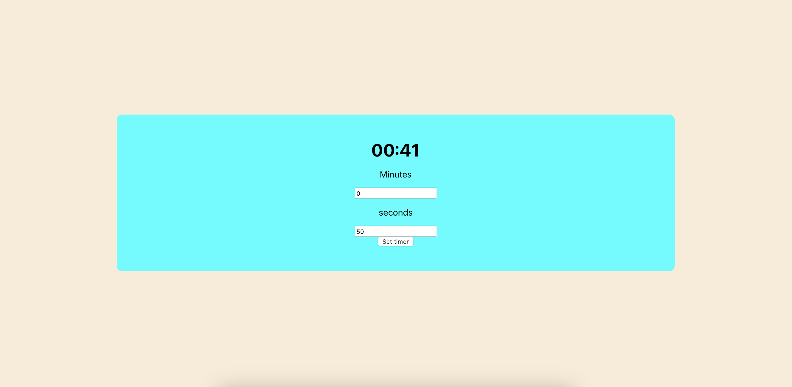

# React POMODORO timer

  

 

A pomodoro timer written in React

## Features

🚀 You can set the minutes

🚀 You can set the seconds

## How to Install

1. Clone this project into a directory

`git clone https://github.com/muhdmirzamz/react-pomodoro-timer.git`

2. `cd` into the project directory and `npm install`

3. `npm start`

Click for things learned

## Things learned 🤓

💡 Dealing with milliseconds to calculate the minutes and the seconds

💡 Learnt how to format the time

💡 Learnt how to use `setInterval` and how we can clear them

